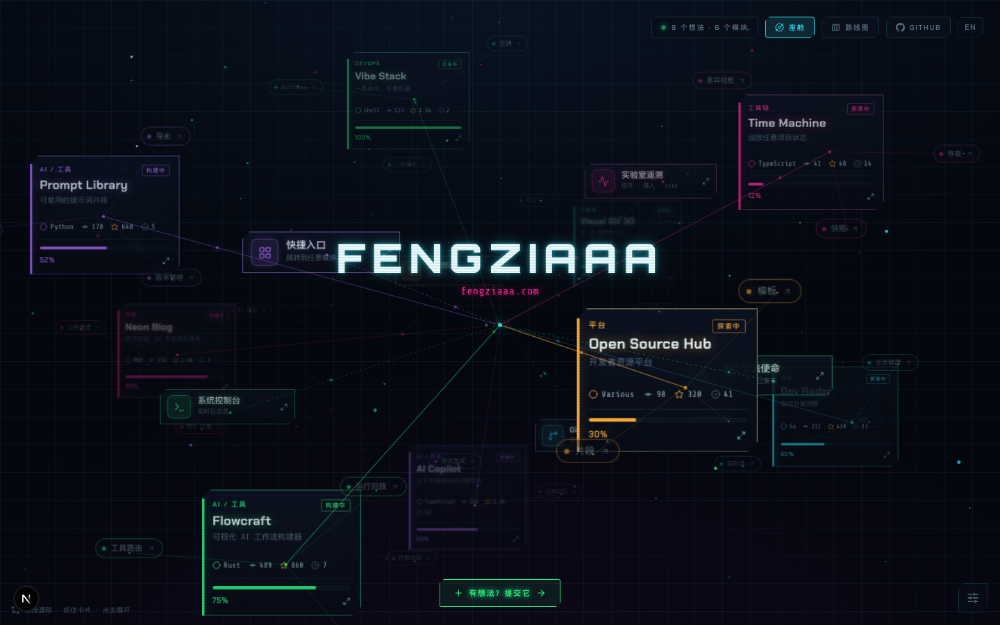
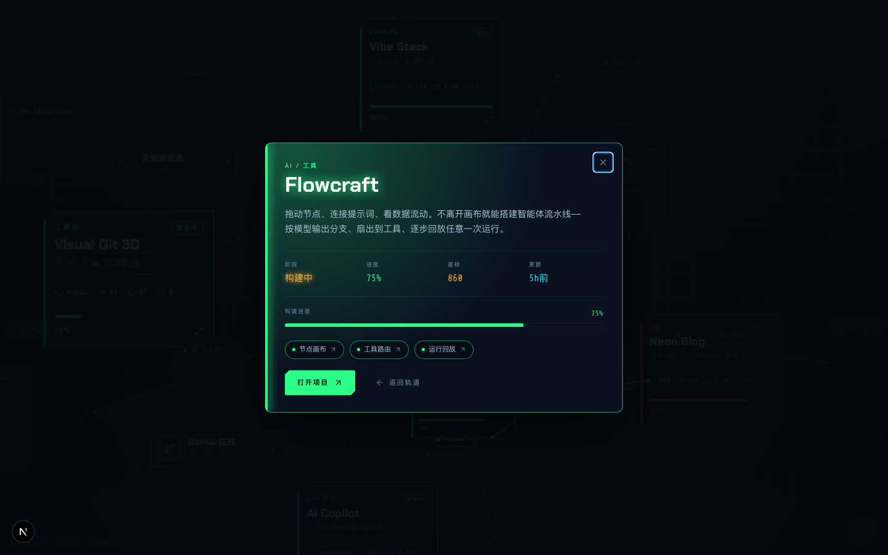
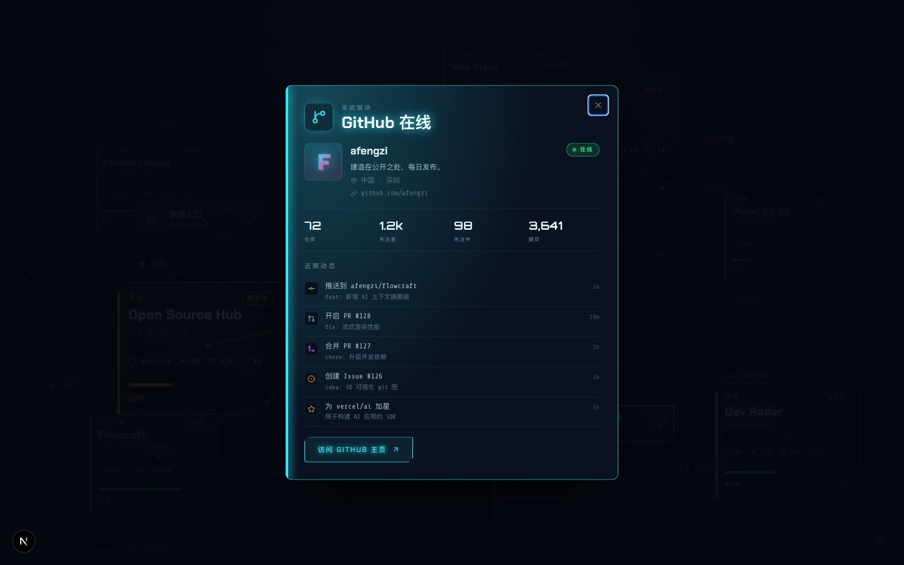
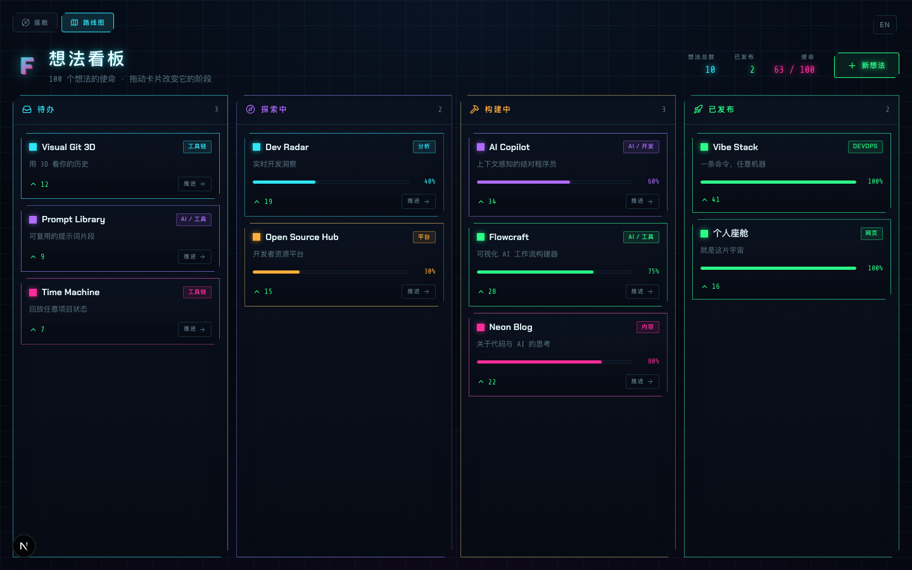

# FENGZIAAA · Lab Cockpit

A cyberpunk "Vibecoding Personal Lab" homepage — an immersive cosmos where your
projects float around you, system modules orbit a central hub, and visitors can
submit ideas that move across a roadmap kanban. Bilingual (中文 / English).

Faithful re-implementation of the Claude Design prototype in `design-src/`.



| Project fly-card | GitHub presence | Roadmap kanban |
| --- | --- | --- |
|  |  |  |

## Stack

- **Next.js (App Router) + TypeScript**, Tailwind v4, shadcn/ui (base-ui)
- **next-intl** — bilingual, cookie-remembered, no URL routing
- **Supabase (Postgres)** — visitor ideas + votes (moderated, 先审后发)
- **Motion** (overlays), **dnd-kit** (kanban), **lucide-react**, **Sonner**
- Signature visuals hand-written: starfield + 3D node field + connection canvas
  (`lib/cosmos/`), neon HUD panels (`app/cosmos.css`)

## Develop

```bash
git clone https://github.com/afengzi/personal-lab.git
cd personal-lab
pnpm install
cp .env.example .env.local      # fill in values (see below)
pnpm dev                        # http://localhost:3000
pnpm test                       # vitest (projection / voterKey / content keys)
pnpm lint
```

### Local Supabase (the backend)

```bash
supabase start                  # local Postgres + API (Docker)
supabase db reset               # apply migrations in supabase/migrations/
supabase status -o env          # prints API URL + anon/service keys
```

Put those into `.env.local`:

```
NEXT_PUBLIC_SUPABASE_URL=http://127.0.0.1:54421
NEXT_PUBLIC_SUPABASE_ANON_KEY=...
SUPABASE_SERVICE_ROLE_KEY=...
GITHUB_HANDLE=afengzi          # any GitHub username — see "Make it yours"
ADMIN_SECRET=choose-a-secret
```

> Local ports are remapped to the **544xx** range in `supabase/config.toml` to
> avoid an ssh tunnel occupying the default 5432x ports on this machine.

Without Supabase env, the app still runs: visitor ideas fall back to a seed and
submit/vote are no-ops (cosmos, overlays, roadmap, tweaks all work).

### Moderation

Visitor submissions land as `pending`. Approve them at **`/admin`** (enter
`ADMIN_SECRET`), or directly in the Supabase dashboard by setting `status`.

## Make it yours

- **GitHub** — set `GITHUB_HANDLE` to any username; `lib/github.ts` fetches that
  account's public profile/repos/events (no token needed; `GITHUB_TOKEN` optional
  to raise the rate limit).
- **Brand** — the `FENGZIAAA` wordmark lives in `components/CosmosScreen.tsx`
  (center) and the loading fallback in `components/CosmosHome.tsx`; the domain is
  `brand.domain` in `messages/{zh,en}.json`; owner fallback in `content/telemetry.ts`.
- **Projects** — edit `content/ideas.ts` + the `ideas.*` keys in the dictionaries.

## Deploy (Vercel)

The frontend deploys as-is. For the **backend** in production you need a **hosted
Supabase** (Vercel can't reach a local one):

1. Create a project at supabase.com, run the SQL in `supabase/migrations/` on it.
2. On Vercel set env: `NEXT_PUBLIC_SUPABASE_URL`, `NEXT_PUBLIC_SUPABASE_ANON_KEY`,
   `SUPABASE_SERVICE_ROLE_KEY`, `GITHUB_HANDLE`, optional `GITHUB_TOKEN`, `ADMIN_SECRET`.
3. `vercel` (or connect the repo). Without the Supabase env it deploys with the
   mock fallback + real GitHub data.

## Deploy (self-hosted Docker)

Alternatively, CI (`.github/workflows/deploy.yml`) builds the `Dockerfile` image,
pushes it to GHCR, and runs `deploy/deploy.sh` on the server — it applies the
`lab_*` migrations into an existing self-hosted Supabase Postgres and (re)starts
the app container. Configure the repo vars (`SERVER_HOST`, `SERVER_USER`,
`DOMAIN`, `GH_HANDLE`) and secrets (`DEPLOY_SSH_KEY`, `ADMIN_SECRET`).

## Layout

```
app/            routes (/ cosmos, /roadmap, /admin, /api/*) + globals + cosmos.css
lib/cosmos/     starfield, 3D field, projection (unit-tested)
lib/ideas/      voterKey (unit-tested), repo
lib/supabase/   service-role admin client
lib/github.ts   cached public GitHub fetch
components/hud/      neon primitives     components/overlays/  fly-card + module panels
components/board/    kanban              components/tweaks/    tweaks panel
content/        curated data (i18n keys)    messages/  zh + en dictionaries
design-src/     the original exported prototype (reference)
docs/superpowers/   spec + implementation plan
```
